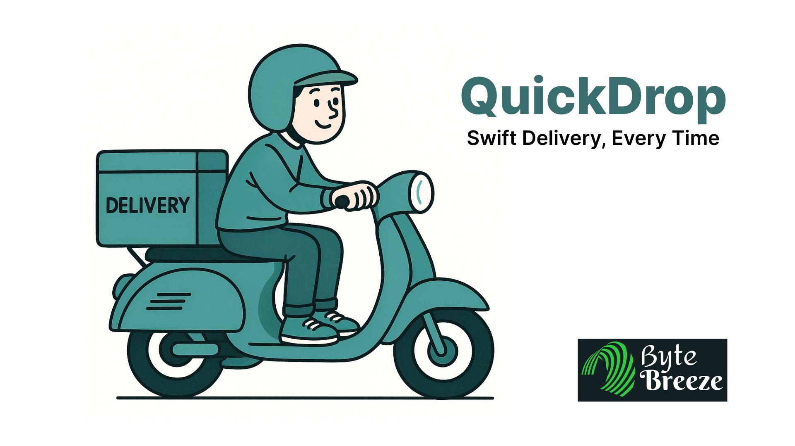
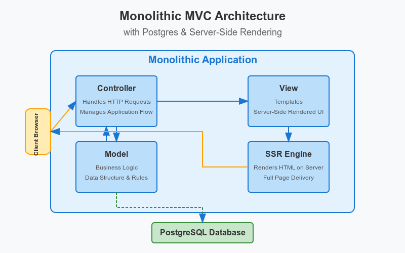
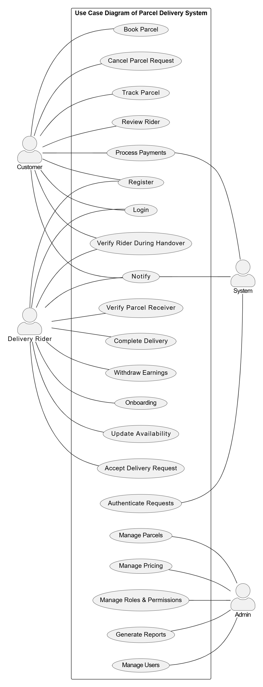
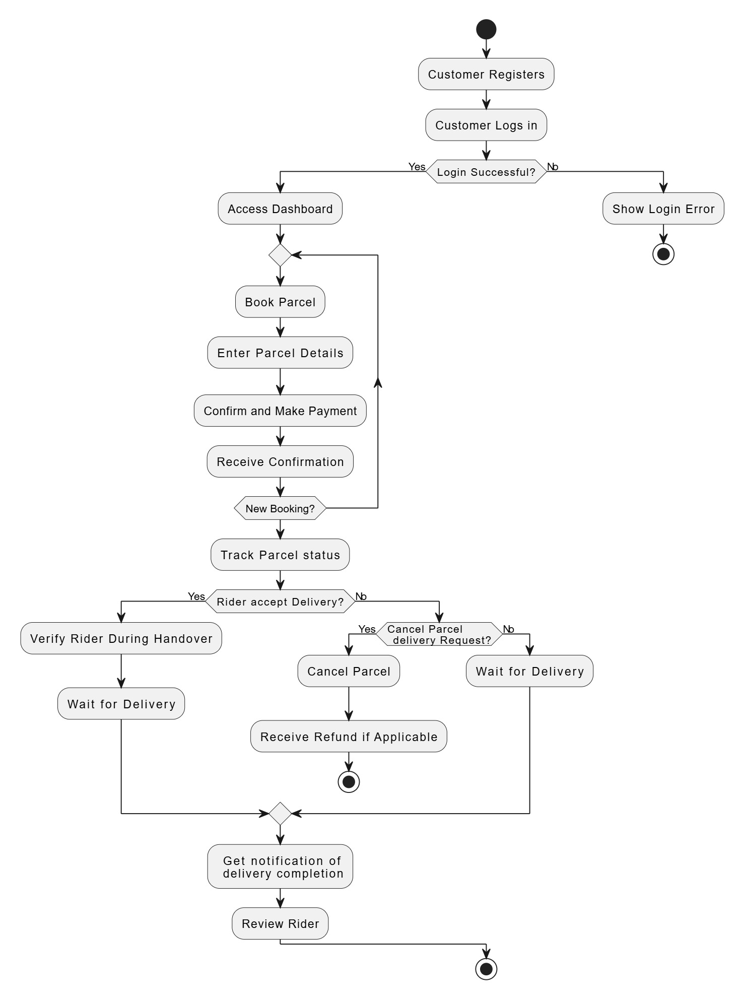
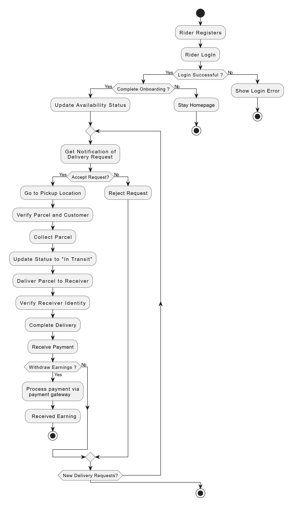
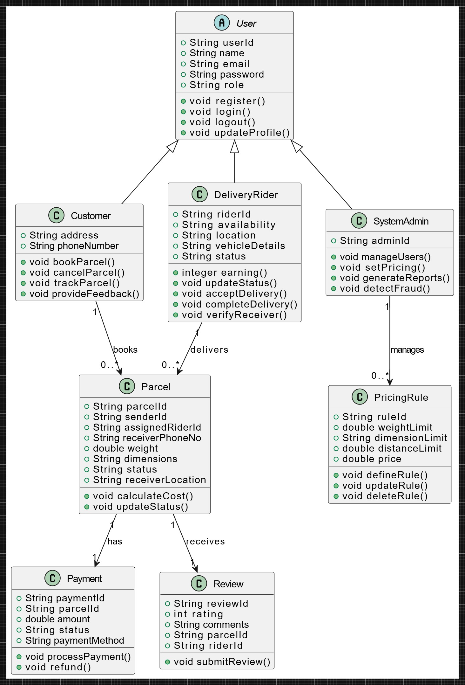
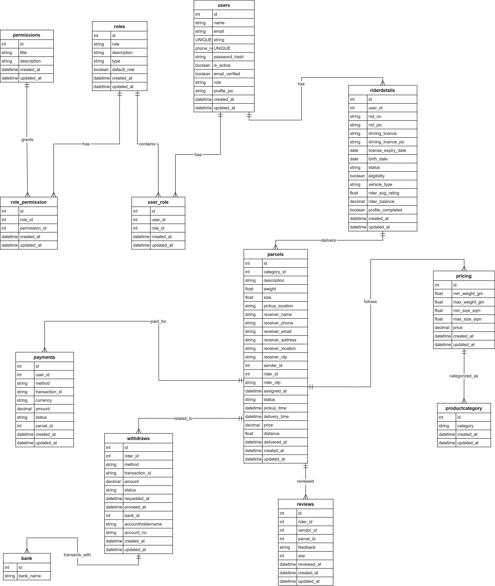
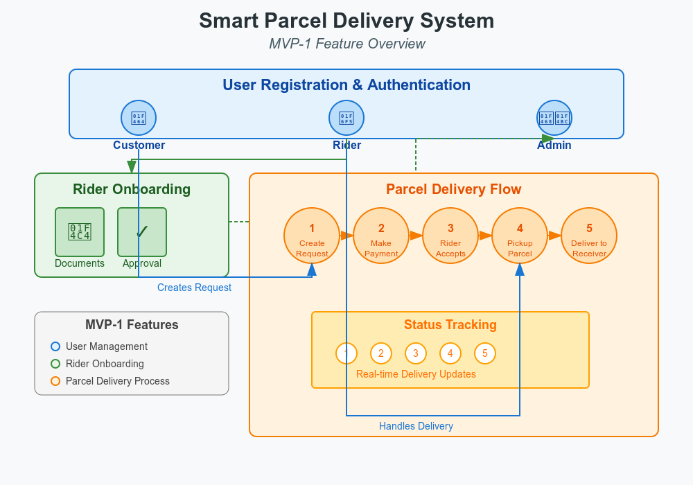

<div align="center">

<div align="center">
  
</div>


# 📦Smart Parcel Delivery System


<!-- Row 1 -->


</div>


---
<div align="center">

[](https://deliveryparcel.me)

<br/>

[](https://tracing.deliveryparcel.me/)
[](https://metrics.deliveryparcel.me/)
[](https://monitor.deliveryparcel.me/)
[](https://logs.deliveryparcel.me/)

<br/>

[](https://docs.google.com/spreadsheets/d/1xkvcfqKs8xaK-G49qsPYhYuLTmGR0uW70pVxoA6MyY0/edit?gid=1578793000#gid=1578793000)
[](https://github.com/Learnathon-By-Geeky-Solutions/byte-breeze/tree/main/docs/Team/UML)
[](https://github.com/orgs/Learnathon-By-Geeky-Solutions/projects/69/views/6?filterQuery=-sprint%3A%22Sprint+7%22)
[](https://github.com/Learnathon-By-Geeky-Solutions/byte-breeze/wiki)
[](https://github.com/Learnathon-By-Geeky-Solutions/byte-breeze/issues)

</div>

---


## 📊 SonarCloud Analysis

[](https://sonarcloud.io/summary/new_code?id=Learnathon-By-Geeky-Solutions_byte-breeze)
[](https://sonarcloud.io/summary/new_code?id=Learnathon-By-Geeky-Solutions_byte-breeze)
[](https://sonarcloud.io/summary/new_code?id=Learnathon-By-Geeky-Solutions_byte-breeze)
[](https://sonarcloud.io/summary/new_code?id=Learnathon-By-Geeky-Solutions_byte-breeze)


---
## 📑 Table of Contents

<details>
<summary> Click to expand/collapse</summary>

- [Live Deployment](#-live-deployment)
- [Team Members & Mentor](#-team-members--mentor)
- [Project Introduction](#-project-introduction)
- [Project Context](#-project-context)
- [Key Features](#-key-features)
    - [Customer (P2P)](#-customer-p2p)
    - [E-Commerce Seller (B2C)](#-e-commerce-seller-b2c)
    - [Delivery Rider](#-delivery-rider)
    - [System Admin](#-system-admin) 
- [System Design & Architecture](#-system-design-&-architecture)
- [Tech Stack](#-tech-stack)
- [Project Structure](#-project-structure-simplified)
- [Project Resources](#-project-resources)
- [Released Features (MVP)](#-Released-Features-(MVP))
- [Getting Started](#getting-started)
- [Development Guidelines](#development-guidelines)
- [Resources](#resources)

</details>

---

## 🚀 Live Deployment

<table>
<tr>
<td width="60%" valign="top">

### 🌐 Production Environment (Azure VM - IAAS)
[](https://deliveryparcel.me/)

> The production environment is hosted on Azure VM as an IAAS solution for optimal performance and reliability.

### 🛠️ Development Environment (Render - PAAS)
[](https://quickdrop-q0q3.onrender.com/)

> The development environment is hosted on Render as a PAAS solution for testing and development purposes.

#### 🔐 Portal Access Credentials
| Portal       | URL                                                                 | Email               | Password          |
|--------------|---------------------------------------------------------------------|---------------------|-------------------|
| **Customer** | [Login](https://quickdrop-q0q3.onrender.com/auth/login)  | `user2@gmail.com`   | `@Padma&1953`     |
| **Rider**    | [Login](https://quickdrop-q0q3.onrender.com/rider/login) | `amirider@gmail.com`| `@Amirider&1953`  |
| **Admin**    | [Login](https://quickdrop-q0q3.onrender.com/admin/login) | *Access Restricted* | *Access Restricted* |

> **Note**: Production credentials are restricted for security reasons.

</td>
<td width="40%" valign="top">


<div align="center">
  <br/>
  <p> <b>Landing Page</b></p>
</div>

</td>
</tr>
</table>

---
## 👥 Team Members & Mentor

| Role        | GitHub Profile                                      |
|-------------|-----------------------------------------------------|
| Team Leader | [Suvash Kumar Sumon](https://github.com/suvashsumon)     |
| Member      | [Khairul Basar](https://github.com/KhairulBasharbd) |
| Member      |  [Tofaal](https://github.com/Tofaal9152)        |
| Mentor      |  [Jamilxt](https://github.com/jamilxt)             |


---

## 🎯 Project Introduction

<h1 align= "center">Smart Parcel Delivery System</h1>

A tech-driven, role-based parcel delivery platform designed to address the modern challenges of intra-city logistics. Built to streamline the delivery process for **customers**, **e-commerce sellers**, and **delivery riders**, with powerful admin tools and real-time tracking capabilities.

<div align="center">
  
  <span>        </span>
  
  <br />
  <p> <b>Main flow of parcel delivery system</b></p>
  
</div>

---

## 🚀 Project Context

With rapid urbanization and the e-commerce boom, the demand for reliable, efficient, and transparent parcel delivery services has skyrocketed. Traditional systems fall short—facing issues like delays, poor tracking, and ineffective communication.

**Smart Parcel Delivery System** bridges this gap through a robust, GPS-enabled, user-friendly solution that offers:
- Real-time tracking
- Role-specific dashboards
- Transparent communication
- Seamless delivery management

---
## 🔑 Key Features

### 👤 Customer (P2P)
- 📍 **User-Friendly Booking** – Set pickup/drop-off locations and parcel details
- 🧱 **Product Categorization** – Choose from predefined categories with limits
- 🔔 **Order Notifications** – Updates when a rider accepts/completes a delivery
- 📡 **Real-Time Tracking** – GPS tracking for live parcel status
- ⭐ **Feedback System** – Rate and review rider performance
- 🤝 **Secure Handover** – Only authenticated riders can receive parcels

### 🛒 E-Commerce Seller (B2C)
- 📊 **Seller Dashboard** – Track deliveries and rider assignments
- 🔔 **Order Notifications** – Instant alerts on delivery progress
- 📡 **Live Tracking** – Monitor each parcel in real time
- 📈 **Analytics & Reports** – View rider performance, success rates
- ⭐ **Feedback System** – Rate and review services
- 🤝 **Secure Handover** – Verified handover to rider

### 🛵 Delivery Rider
- 📶 **Rider Status** – Set availability status
- 🔔 **Delivery Alerts** – Nearby requests via push notifications
- 🗺️ **Route Navigation** – Optimized GPS-based routing
- 📦 **Order Management** – Accept, manage, and complete deliveries
- ⭐ **Performance Reviews** – Access feedback and ratings
- 🤝 **Secure Delivery** – Handover only to verified recipients
- 💵 **Payment** – Receive payment after each delivery

### 🛠️ System Admin
- 👥 **User & Delivery Management** – Oversee accounts and operations
- 📊 **Analytics Dashboard** – Insights into system and rider efficiency
- 🎯 **Parcel & Pricing Control** – Define pricing models and limits
- 🛡️ **Fraud Detection** – Monitor and prevent suspicious activity

---
## 🏗 System Design & Architecture

### Architecture Diagram
<div align="center">
  <br/>
  <p> <b>High level architecture of our system</b></p>
</div>

### UML Diagram

#### Use Case Diagram
  The main actors in our system are:
- **Customer** - Books parcels and tracks deliveries.
- **Delivery Rider** - Accepts and delivers parcels.
- **System Admin** - Manages users and monitors system activities.
<div align="center">
  <br/>
  <p> <b>Use case diagram of our system</b></p>
</div>

#### Activity Diagram

##### Parcel Booking Process by Customer(sender):

<p align="center">
    
    <br />
    <b>Activity Diagram for Customer(sender)</b>
</p>


##### Parcel Delivery Process By Rider:

<p align="center">
    
    <br />
    <b>Activity Diagram for Delivery Rider</b>
</p>

#### Class Diagram
##### Key Classes:
1. **User** (Base class for Customer, Seller, Rider, and Admin).
2. **Customer** (Send the parcel delivery request)
3. **Rider** (Delivery the parcel from sender to receiver)
4. **Admin** (Manages the system and parcel)
5. **Parcel** (Represents a Parcel to be delivered).
6. **Payment** (Handles transactions for sending a parcel ).
7. **Pricing Rule** (Set the price for a specific parcel).
8. **Review** (Handles customer ratings and feedback).


<p align="center">
    
    <br />
    <b>Class Diagram of System</b>
</p>

<p align="center">
    
    <br />
  <b>Type of UML relationship sign</b>
</p>


### Database Diagram
<p align="center">
    
    <br />
  <b>Initial ERD of our system</b>
</p>
The Entity-Relationship (ER) diagram above visually represents the database schema and relationships between tables.


---
## 🧰 Tech Stack

| Layer           | Technology                                 |
|----------------|--------------------------------------------|
| **Frontend**    | React.js, Thymeleaf                        |
| **Styling**     | HTML, Tailwind CSS                         |
| **Backend**     | Java, Spring Boot                          |
|**Databse Versioning** | Flyway                                     |
| **Authentication** | Spring Security, JWT                       |
| **Database**    | PostgreSQL (Relational), Hibernate ORM     |
| **APIs**        | RESTful APIs, Spring MVC                   |
| **Testing**     | JUnit (Unit),Mockito, JMeter (Load) |
| **DevOps**      | Azure (IAAS Deployment), Render (PAAS Deployment), GitHub Actions (CI/CD)   |
| **Version Control** | Git, GitHub                                |
|**Observability**| OpenTelemetry, JaegerUI, Prometheus, Grafana, Loki           |
|**Project Management**| Github Project         |
---

## 📁 Project Structure (Simplified)
```
├───config
├───controller
├───dto
│   ├───paymentapiresponse
│   ├───request
│   └───response
├───enums
├───exception
│   └───custom
├───mapper
├───model
├───repository
├───security
├───service
└───util
```


## 🧱 Released Features (MVP)
                                      
<p align="center">
    
    <br />
  <b>Released features of our system in first MVP</b>
</p>


## Getting Started
0. **Ensure Prerequisites:** Ensure your system have those running:

| Tool        | Required Version | Download Link                                          |
|-------------|------------------|--------------------------------------------------------|
| Java JDK    | 17+              | [Download JDK](https://adoptium.net/)                 |
| Gradle      | Wrapper included | N/A (uses `./gradlew`)                                |
| PostgreSQL  | 12+              | [Download](https://www.postgresql.org/download/)      |
| Git         | Any              | [Download](https://git-scm.com/downloads)             |

1. **Clone Project:** Clone the project to your local machine using SSH:
```
git clone git@github.com:Learnathon-By-Geeky-Solutions/byte-breeze.git
```
2. **Nevigate to Directory:** Navigate to the Project Directory:
```
cd byte-breeze
```
3. **Install Dependencies:** Use Gradle Wrapper to install dependencies and build the application:
```
./gradlew build --refresh-dependencies
```
Make sure you have executable permission on `gradlew`. If not, run:
```
chmod +x gradlew
```
4. **Set Environment Variables:** To run this project you need to set the following environment variables on your environment:
```
DB_URL=your_postgresql_database_url
DB_USERNAME=your_postgresql_database_username
DB_PASSWORD=your_postgresql_database_password
SSLCOM_STORE_ID=your_sslcommerz_store_id
SSLCOM_STORE_PASSWD=your_sslcommerz_store_password 
SSLCOM_BASE_URL=your_sslcommerz_base_url
```
5. **Run:** Run the Application by this command:
```
./gradlew bootRun
```
The app will start on the default port: `http://localhost:8080`

## Resources
- [Project Documentation](docs/)
- [Development Setup](docs/setup.md)
- [Contributing Guidelines](CONTRIBUTING.md)
